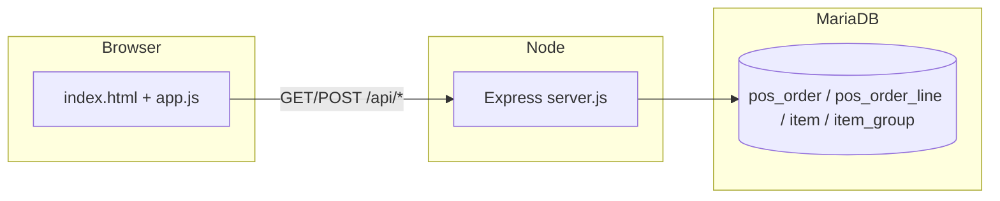

# KDS — Kitchen Display System

A lightweight kitchen display for restaurants. It reads active POS orders from **MariaDB**, shows them as touch-friendly cards in the browser, and lets kitchen staff update line status and served state through a small **Express** API. The frontend is **vanilla HTML, CSS, and JavaScript** (no UI framework).

## Features

- **Live order list:** Fetches data from `/api/orders` every **5 seconds** and updates cards in place (add/remove cards without reloading the whole page).
- **Per-line served:** Tap a line to mark it served (`kds_served`). Served lines appear visually completed; tap again to **undo** served state.
- **Order-level status:** Header color reflects aggregate line `kds_status`: all `0` (red), mixed (orange), all `2` (green). Tap the header to set the whole order to **ready** (`kds_status = 2`) via the status API.
- **Header menu (⋯):** Set all lines to **in progress** (`1`) or **ready to hand out** (`2`).
- **Auto-close after full serve:** When the last unserved line is marked served, the UI waits **30 seconds**, animates the card away, then calls `POST /api/done/:orderId` to mark all lines served and set the order to **closed**. The same delay applies when the whole order is set to status `2` from the menu.
- **Prep summary:** **PODSUMOWANIE** opens a modal with total quantities per product name (only lines not locally marked done).
- **Work mode:** **TRYB PRACY** shows a left sidebar with quantities grouped by **item category** (from `item_group`), excluding done/ready lines.
- **Timers:** Each card shows elapsed time since `created_at`, refreshed on a `setInterval` callback in `app.js` (the order poll runs every **5 seconds**).
- **Notes and quantity:** Line notes and multi-qty display are supported in the card layout.
- **Parent line id:** Each row includes `id_pos_order_line_parent` for potential combo/modifier grouping in the UI (extend as needed).

## Tech stack

| Layer | Technology |
|--------|--------------|
| Runtime | Node.js (ES modules: `"type": "module"`) |
| Server | Express 5 |
| Database | MariaDB via `mariadb` connection pool |
| Config | `dotenv` — credentials and port from environment |


## Requirements

- Node.js **18+** recommended
- MariaDB with POS schema compatible with the queries in `server.js`

## Configuration

1. Copy the example env file:

   ```bash
   cp .env.example .env
   ```

   On Windows PowerShell:

   ```powershell
   Copy-Item .env.example .env
   ```

2. Edit `.env`:

   | Variable | Description |
   |----------|-------------|
   | `PORT` | HTTP port (default `3000`) |
   | `DB_HOST` | MariaDB host |
   | `DB_NAME` | Database name |
   | `DB_USER` | Database user |
   | `DB_PASSWORD` | Database password |

Do **not** commit `.env`; it is listed in `.gitignore`.

## Install and run

```bash
npm install
npm start
```

Then open **http://localhost:3000** (or `http://localhost:<PORT>` if you changed `PORT`).

For a one-off run without the npm script:

```bash
node server.js
```

## How it works (high level)



The server serves the project root as static files and exposes JSON routes under `/api`.

## Database (used tables)

The `GET /api/orders` handler joins:

| Table | Role |
|-------|------|
| `pos_order` | Order header: id, table/name, `status`, `created_at` |
| `pos_order_line` | Lines: name, qty, `kds_served`, `kds_status`, `note`, parent line id, item link |
| `item` | Links a line to catalog / group |
| `item_group` | Category name for work-mode grouping |

**Important query behavior:** Active orders are those with `pos_order.status` **not** in `closed` or `cancelled`, and at least one order line exists. The query is limited to **200 result rows** total (lines × orders — not “200 orders”). Served lines are still returned so the client can show them as completed until the next refresh.

**Line fields used by the app**

- `kds_served` — timestamp when the line was served; `NULL` means not served.
- `kds_status` — numeric kitchen flow state (`0` / `1` / `2` as used in the UI).

## API reference

| Method | Path | Description |
|--------|------|-------------|
| `GET` | `/api/orders` | Active orders with lines (joins + `LIMIT 200`). |
| `POST` | `/api/done/line/:id` | Set `kds_served = NOW()` for one line. If no unserved lines remain for that order, sets all lines `kds_status = 2`. Returns `{ ok, orderId, allServed }`. |
| `POST` | `/api/undo/line/:id` | Clear `kds_served`, set line `kds_status = 0`, set order `status = 'open'`. |
| `POST` | `/api/done/:id` | Set `kds_served = NOW()` on **all** lines of order `:id`, set order `status = 'closed'`. |
| `POST` | `/api/done/empty/:id` | Set order `status = 'cancelled'` (empty-order cleanup). |
| `POST` | `/api/status/line/:id/:status` | Set `kds_status` for one line. |

Errors return JSON like `{ "error": "<message>" }` with HTTP **500** (or **404** for unknown line on undo).

## UI strings and locale

The interface copy and time formatting are oriented toward **Polish** (`pl-PL`) in the current `index.html` / `app.js`. The README is in English for maintainers and onboarding.

## Project layout

```
kds-app/
├── server.js       # Express app + MariaDB + API
├── index.html      # Shell + buttons + modal + layout
├── app.js          # Polling, cards, timers, work mode
├── styles.css      # Layout, card chrome, animations
├── package.json
├── .env.example    # Template for local configuration
└── README.md
```

## Security notes

- Keep database credentials only in `.env` or your process manager — not in source control.
- This app is intended on a trusted LAN (kitchen display). If you expose it publicly, add authentication, TLS, and network controls.

## License

See `package.json` (`license` field).
